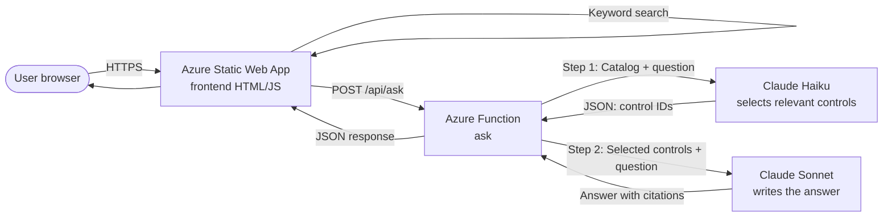
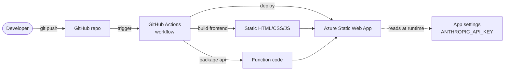

# CJIS Security Policy Lookup

An AI-powered lookup tool for the FBI's Criminal Justice Information Services (CJIS) Security Policy v6.0. Combines fast keyword search with a two-stage Claude pipeline that answers plain-language compliance questions using only the policy text.

**Live demo:** https://kind-sand-01230ec10.7.azurestaticapps.net

---

## Why this exists

The CJIS Security Policy is the federal standard that any agency handling Criminal Justice Information must comply with. The current version (v6.0, December 2024) is a 350+ page PDF organized as a catalog of NIST 800-53 controls (AC-1, AC-2, IA-5, etc.).

Compliance analysts, security engineers, and auditors regularly need to:
- Look up a specific control by ID
- Search for controls relevant to a topic (e.g. "multi-factor authentication")
- Get a plain-language answer to a policy question with citations

This tool does all three. The keyword search runs entirely in the browser (no API calls, no cost). The plain-language Q&A uses a two-stage LLM cascade designed to minimize cost while keeping answers grounded in the actual policy text.

---

## What it does

### 1. Keyword search
Type a control ID (`AC-2`) or a keyword (`encryption`, `audit`) and get matching controls with previews. Runs client-side against a pre-parsed JSON catalog.

### 2. AI-powered Q&A
Ask a natural-language question (e.g. *"What does CJIS say about multi-factor authentication?"*). The system:
1. Sends the catalog of all 258 control titles to Claude Haiku, which selects the 3–8 most relevant controls
2. Sends only those selected controls' full text to Claude Sonnet, which writes the answer with citations
3. Returns the answer + the list of controls used

This two-stage approach reduces input tokens to Sonnet by ~8x compared to sending the full policy, lowering cost and improving answer focus.

---

## Architecture

### Request flow



The frontend handles keyword search locally for speed. The AI Q&A goes through a serverless Function that orchestrates two Claude calls.

### Deployment flow



Every push to `main` triggers a build and deployment. The frontend, the Function code, and the routing config are all deployed as one unit.

### Infrastructure as Code

The Azure infrastructure can be deployed two ways:
- **Via the portal** (clicking through the wizard) — fast but not reproducible
- **Via Bicep templates** — declared as code in `bicep/`, deployable via Azure CLI

The Bicep approach creates the same resources but is reproducible, version-controlled, and reviewable. See the `bicep/` folder.

---

## Tech stack

| Layer | Technology | Why |
|---|---|---|
| Frontend | Plain HTML/JS, no framework | Lightweight; serves instantly; no build step |
| Hosting | Azure Static Web Apps (Free tier) | Free global CDN; integrated routing; managed Functions support |
| Backend | Azure Functions (Node.js, V3 model) | Serverless; pay only when called; integrates with Static Web Apps |
| AI | Anthropic Claude (Haiku + Sonnet) | Two-tier model cascade for cost-efficient grounded answers |
| Data | Pre-parsed JSON of 258 CJIS controls | Source: FBI CJIS Policy v6.0 PDF (public document) |
| CI/CD | GitHub Actions | Pre-wired by Azure Static Web Apps |
| IaC | Bicep | Declares the Azure resources as code |

---

## Key design decisions

### Two-stage LLM cascade (Haiku → Sonnet)

The naive approach is to send the entire policy to a large model for every question. That works but is expensive (~200,000 input tokens per question) and the model has to filter through irrelevant content.

Instead:

- **Stage 1 (Haiku):** Receives a compact catalog of all 258 control titles (~3,300 tokens) and the user's question. Returns a JSON array of 3–8 control IDs.
- **Stage 2 (Sonnet):** Receives only the full text of the selected controls (~25,000 tokens) and writes the answer.

This pattern is sometimes called the *small-then-big cascade* or *router pattern*. Benefits:
- ~8x reduction in Sonnet input tokens per question
- Better focus (less irrelevant context to filter)
- Tiny Haiku cost (fractions of a cent per question)
- Catalog and system prompts are cached (`cache_control: ephemeral`) for additional savings

### Prompt caching

The control catalog passed to Haiku is identical for every question. The same applies to the system prompts. Both are marked with `cache_control: { type: 'ephemeral' }`, which means Anthropic charges a reduced rate when the same prefix is reused within the cache window. After the first call, subsequent calls are noticeably cheaper.

### Static-first with serverless escape hatch

The site is fundamentally static — HTML, CSS, JS, and a JSON data file. Everything except Q&A runs entirely in the browser, which is fast, cheap (free), and survives even if the AI service is down. The Function exists only for the one feature that genuinely needs a server: the AI Q&A, where the API key cannot be exposed to the browser.

### Secret management

The Anthropic API key never appears in code or the repo. It's stored as an Azure Static Web App application setting (encrypted at rest, injected as `process.env.ANTHROPIC_API_KEY` at runtime). For local development, the same key lives in `api/local.settings.json`, which is gitignored.

### Routing config (`staticwebapp.config.json`)

Static Web Apps' default routing blocks POST methods on Function endpoints unless explicitly allowed. The config file in the repo root tells the routing layer to accept POST on `/api/ask` and to treat unknown paths as falling through to `index.html`.

---

## Repository structure
├── public/
│   └── index.html              # The frontend (search UI + Ask Claude)
├── api/
│   ├── ask/
│   │   ├── function.json       # HTTP trigger config
│   │   └── index.js            # The Q&A function (two-stage Claude cascade)
│   ├── host.json
│   ├── package.json
│   └── controls.json           # Deployed alongside the function
├── bicep/
│   ├── main.bicep              # Subscription-scoped: creates RG + module call
│   └── staticwebapp.bicep      # Module: creates the Static Web App
├── .github/workflows/          # GitHub Actions CI/CD
├── staticwebapp.config.json    # SWA routing config
├── controls.json               # Pre-parsed policy data (258 controls)
├── download.js                 # Script to download the FBI PDF
├── parse.js                    # Script to extract controls from the PDF
├── server.js                   # Local Express server for development
└── package.json

---

## How to recreate this from scratch

### Prerequisites

- An Anthropic API key — get one at https://console.anthropic.com
- An Azure subscription (Free tier is sufficient)
- A GitHub account
- Node.js 18+ installed locally
- (For Bicep deployment) Azure CLI installed

### Step 1: Clone and set up locally

```bash
git clone https://github.com/your-username/cjis-policy-lookup.git
cd cjis-policy-lookup
npm install
```

Create a `.env` file in the root with your Anthropic API key:
ANTHROPIC_API_KEY=sk-ant-api03-your-key-here

### Step 2: Build the data

```bash
npm run download    # Downloads the CJIS Policy PDF from the FBI
npm run parse       # Extracts the 258 controls into controls.json
```

### Step 3: Run locally

```bash
npm start
```

Open http://localhost:3000 to test.

### Step 4: Deploy to Azure

You have two options.

**Option A: Portal (faster for first deployment)**

1. Push the repo to your own GitHub
2. In the Azure portal, create a Static Web App
3. Connect it to your GitHub repo, branch `main`
4. App location: `/public`, API location: `api`, Output location: blank
5. After deployment, add an Application Setting in Azure: `ANTHROPIC_API_KEY` = your key

**Option B: Bicep (reproducible)**

```bash
cd bicep
az login
az deployment sub create \
  --name cjis-deploy \
  --location centralus \
  --template-file main.bicep \
  --parameters staticWebAppName=your-unique-name
```

Then link the Static Web App to your GitHub repo via the portal (Bicep can also do this if you add `repositoryUrl`, `branch`, and `repositoryToken` to the SWA properties).

### Step 5: Configure routing

The `staticwebapp.config.json` file in the repo root is required for POST requests to `/api/ask` to work. Make sure it's present before deploying.

---

## Limitations and honest caveats

This is a working POC, not a production system. Specifically:

- **No rate limiting.** Anyone with the URL can call `/api/ask` repeatedly, which costs the deployer money via the Anthropic API. The deployer should set a spending cap on their Anthropic key (Settings → Limits in the Anthropic console).
- **No authentication.** The site is public. Static Web Apps supports built-in auth (GitHub, Microsoft, custom OIDC); not implemented here.
- **Cold starts are slow.** First Function call after idle takes 20–40 seconds. Subsequent calls in the warm window are 5–15 seconds. This is normal for Azure Functions on consumption pricing.
- **Search is exact-match keyword.** The search bar does not use semantic search. The AI Q&A handles semantic queries through Haiku's control selection.
- **The PDF parser is brittle.** `parse.js` depends on the exact layout of CJIS Policy v6.0. A new version of the PDF could break it.
- **Only English.** No localization.
- **No analytics.** No telemetry, no logging beyond Function invocation logs.

For a production version, the additions would be: authentication, rate limiting (probably by IP and by user), structured logging to Application Insights, a CI step that re-parses the PDF on a schedule to detect changes, and a more robust deployment pipeline with a staging environment.

---

## Data source and license

The CJIS Security Policy is published by the FBI as a public document:
https://le.fbi.gov/cjis-division/cjis-security-policy-resource-center

This project does not redistribute the PDF (it's downloaded fresh by `download.js`). The parsed JSON of control IDs and titles is a transformation of public-domain government content.

The code in this repository is provided as-is for educational and reference purposes.

---

## Acknowledgments

Built as an exploration of:
- Serverless AI applications on Azure
- Cost-efficient LLM cascade patterns
- Infrastructure as Code with Bicep
- Modern Static Web Apps + Functions architecture
